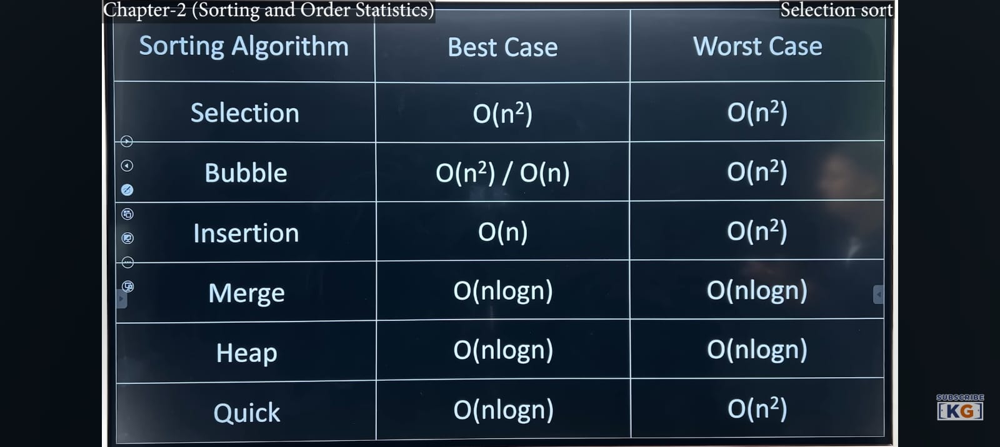

# cDesignAnalysisAlgorithm
Design and Analysis of Algorithm {4thSem}

- Design and Analysis of Algorithms covers the concepts of designing an algorithm as to solve various problems in computer science and information technology, and also analyse the complexity of these algorithms designed. The main aim of designing an algorithm is to provide a optimal solution for a problem. Here some codes of data structures maintaining proper algorithms that are written in C.

The recurrence relation for the worst-case time complexity of the quick sort algorithm is 
## T(n) = T(n-1) + Θ(n), 
which gives a worst-case time complexity of Θ(n2). This occurs when the first or last element is chosen as the pivot element during each call of the partition algorithm.

This worst-case situation results in an unbalanced partition process, where one subarray has n-1 elements and the other is empty. This worst case always occurs for sorted or reverse sorted arrays.

